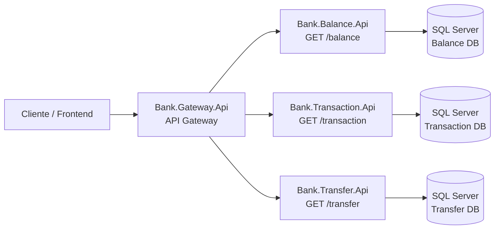
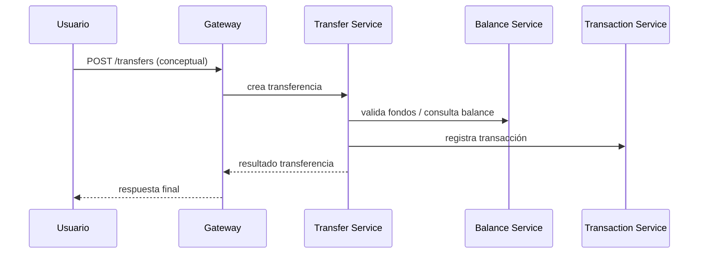

# 🏦 Bank Transfer Microservices Architecture (ASP.NET 8 + EF Core + SQL Server)

> **Objetivo del repo:** ejemplo **simple, explícito y didáctico** de una arquitectura de **microservicios** para un dominio bancario (balances, transacciones y transferencias), con un **API Gateway** como puerta de entrada.

---

## 🎨 Stack & Tecnologías

| Capa | Tech |
|------|------|
| Runtime | **.NET 8 (net8.0)** |
| Persistencia | **Entity Framework Core** + **SQL Server** (provider `Microsoft.EntityFrameworkCore.SqlServer`) |
| Estilo API | Minimal APIs (endpoints con `MapGet`) |
| Patrón | Separación por microservicio + API Gateway |

---

## 🧩 Microservicios del repositorio

Estructura principal (carpeta `src/`):

- `Bank.Gateway` → **API Gateway**
- `Bank.Balance` → microservicio de **Balances**
- `Bank.Transaction` → microservicio de **Transacciones**
- `Bank.Transfer` → microservicio de **Transferencias**

> Cada microservicio está construido como un proyecto API en:
`src/<Servicio>/<Servicio>.Api`

---

## 🗺️ Arquitectura (alto nivel)



### 🔎 ¿Qué hace cada componente?
- **Cliente**: app, Postman, curl, etc.
- **Gateway**: punto único de entrada. Centraliza el ruteo hacia servicios internos.
- **Servicios**: cada uno expone su endpoint y se conecta a **su propia base** (independencia).
- **SQL Server**: persiste los datos de cada microservicio.

---

## 📁 Estructura interna típica de un microservicio

Ejemplo visto en `Bank.Balance.Api` (similar en los demás):

- `Application/` → lógica de aplicación (use cases / features)
- `Domain/` → entidades y reglas del dominio
- `Persistence/` → acceso a datos (EF Core / DbContext / implementaciones)
- `Program.cs` → endpoints Minimal API + DI + configuración
- `appsettings*.json` → logging/hosts (las connection strings se inyectan por variables)

---

## ✅ Endpoints disponibles (según el código actual)

### 1) Balance Service (`Bank.Balance.Api`)
- `GET /balance` → devuelve lista de balances desde la DB (EF Core)

En el código se usa:
- `BALANCESQLDBCONSTR` como connection string.

---

### 2) Transaction Service (`Bank.Transaction.Api`)
- `GET /transaction` → devuelve lista de transacciones desde la DB (EF Core)

En el código se usa:
- `TRANSACTIONSQLDBCONSTR` como connection string.

---

### 3) Transfer Service (`Bank.Transfer.Api`)
- `GET /transfer` → devuelve lista de transferencias desde la DB (EF Core)

En el código se usa:
- `TRANSFERSQLDBCONSTR` como connection string.

---

### 4) API Gateway (`Bank.Gateway.Api`)
- Inicializa el gateway y delega endpoints en `ApiGatewayEndpoint.GatewayEndpoint(app);`

> Nota: en este repo, el gateway está “liviano” (esqueleto) y el ruteo/aglutinación de endpoints vive en el módulo `Api/Endpoint`.

---

## 🧪 Ejemplos de uso (curl)

> Como no hay puertos documentados en el repo, en los ejemplos uso variables `BALANCE_URL`, `TX_URL`, etc. (vos podés setearlas a `http://localhost:XXXX` según tu configuración/launchSettings).

### Balance
```bash
curl -s "$BALANCE_URL/balance" | jq
```

### Transaction
```bash
curl -s "$TX_URL/transaction" | jq
```

### Transfer
```bash
curl -s "$TRANSFER_URL/transfer" | jq
```

---

## 🔐 Configuración (variables de entorno)

Estos microservicios **leen la connection string** desde configuración con claves específicas:

| Microservicio | Clave esperada |
|---|---|
| Bank.Balance.Api | `BALANCESQLDBCONSTR` |
| Bank.Transaction.Api | `TRANSACTIONSQLDBCONSTR` |
| Bank.Transfer.Api | `TRANSFERSQLDBCONSTR` |

Ejemplo (PowerShell):
```powershell
$env:BALANCESQLDBCONSTR="Server=localhost;Database=BalanceDb;User Id=sa;Password=Your_password123;TrustServerCertificate=True;"
$env:TRANSACTIONSQLDBCONSTR="Server=localhost;Database=TransactionDb;User Id=sa;Password=Your_password123;TrustServerCertificate=True;"
$env:TRANSFERSQLDBCONSTR="Server=localhost;Database=TransferDb;User Id=sa;Password=Your_password123;TrustServerCertificate=True;"
```

Ejemplo (bash):
```bash
export BALANCESQLDBCONSTR="Server=localhost;Database=BalanceDb;User Id=sa;Password=Your_password123;TrustServerCertificate=True;"
export TRANSACTIONSQLDBCONSTR="Server=localhost;Database=TransactionDb;User Id=sa;Password=Your_password123;TrustServerCertificate=True;"
export TRANSFERSQLDBCONSTR="Server=localhost;Database=TransferDb;User Id=sa;Password=Your_password123;TrustServerCertificate=True;"
```

---

## 🧠 Flujo conceptual (transferencia bancaria)

Este repo hoy expone endpoints de lectura por servicio. Conceptualmente, un flujo típico de transferencia en microservicios podría verse así:



> Esto es un **esquema** de arquitectura/flujo (para explicar el “por qué” de los servicios). La implementación exacta dependerá de endpoints de escritura, validaciones, idempotencia, etc.

---

## 🧰 Solución .NET

En la raíz existe `Bank.sln`, que agrupa los proyectos del repo.

---

## 📝 Estado actual del README

El README anterior sólo contenía un título (`# Bank`).  
Este archivo lo reemplaza por documentación completa y visual de la arquitectura y servicios.

---

## 📄 License

Ver [`LICENSE.txt`](LICENSE.txt).

---
